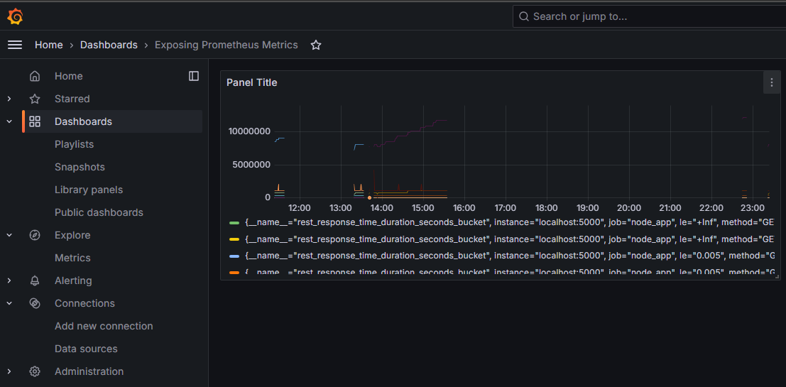

# Prometheus Metrics & Random Data Fetcher

This project demonstrates how to implement a simple API metrics collection system with Prometheus and a frontend for dynamically fetching and displaying random data.

## Table of Contents

- [Overview](#overview)
- [Features](#features)
- [Installation](#installation)
- [Usage](#usage)
  - [Running the Metrics API](#running-the-metrics-api)
  - [Using the Random Data Fetcher](#using-the-random-data-fetcher)
- [Code Explanation](#code-explanation)
  - [promMetric.js](#prommetricjs)
  - [randomData.js](#randomdatajs)
- [Contributing](#contributing)
- [License](#license)

## Overview

This repository includes:

- **`promMetric.js`**: A Node.js application that tracks and exposes metrics like REST API response times using Prometheus-compatible metrics.
- **`randomData.js`**: A JavaScript frontend script that fetches and displays random data from an external API, triggered by user interaction.

## Features

- **Prometheus Integration**: Easily collect and expose metrics for your API.
- **Dynamic Data Fetching**: Frontend script to fetch and display random data categories like Users, Banks, and more.
- **Express.js Backend**: Simple REST API built with Express.js.

# Prometheus Metrics

This repository contains a simple Express.js application that demonstrates how to integrate Prometheus metrics collection using the `prom-client` library. The application defines custom metrics for monitoring the response times of REST API endpoints and database operations.

## Features

- **Custom Metrics**: Collects and exposes metrics related to REST API response times and database response times.
- **Default Metrics**: Automatically collects and exposes default metrics like CPU usage, memory usage, and more.
- **Prometheus Integration**: Exposes metrics in a format that Prometheus can scrape and monitor.
- **Sample Endpoints**: Includes basic sample endpoints to test the monitoring setup.

## Getting Started

### Prerequisites

- Node.js (v14.x or higher)
- npm or yarn
- [Prometheus](https://prometheus.io/download/)
- [Grafana](https://grafana.com/get/)


### Installation

1. Clone the repository:

   ```sh
   git clone https://github.com/JonasZ30/REST_API.git
   ```
2. Install dependencies:
    ```sh
    npm install express prom-client
    ```
### Running Application

Start the application by executing the following command the application will run on `http://localhost:5000`.

   ```sh
   node path/to/promMetric.js
   ```

### Endpoints

- GET /api/sample: Returns a sample response after a random delay. This endpoint is used to simulate and monitor API response times.

- GET /metrics: Exposes the collected metrics in a format compatible with Prometheus.

- GET /api/status: Returns the status of the application.

- POST /api/data: Accepts JSON data and echoes it back in the response.

### Monitoring with Prometheus

Add the following job to your prometheus.yml if not done yet:

   ```sh
         - job_name: "node_app"
    metrics_path: /metrics
    static_configs:
      - targets: ["localhost:5000"]
   ```

### Metrics

- REST API Response Time (rest_response_time_duration_seconds): A histogram that tracks the duration of HTTP requests. Labels include method, route, and status_code.
 
- Database Response Time (db_response_time_duration_seconds): A gauge that can be used to track the response time of database operations. Labels include operation and success.

### Visualizing Metrics with Grafana

1. Configure Prometheus as a data source in Grafana.

2. Create dashboards to visualize the metrics exposed by the application, such as API response times and database operation durations.


